# 📈 Cofinance Analyst


 

> **The Autonomous Investment Committee that lives in your browser.**

---

## 💡 The Pitch

### The Problem

Retail investors are drowning in noise. To analyze a single asset, you need to switch between **TradingView** for charts, **Yahoo Finance** for fundamentals, and **Twitter/News** for sentiment. It's a fragmented, cognitive nightmare that leads to bad decisions.

### The Solution

**Cofinance Analyst** is not just a chatbot—it's an **Agentic Orchestrator**. It unifies the entire financial research workflow into a single conversation. By coordinating a team of specialized AI agents, it delivers institutional-grade analysis, interactive visuals, and real-time data without you ever leaving the chat.

### The Value

* **Context-Aware Intelligence:** Automatically switches strategies based on asset class (e.g., analyzing **P/E** for Stocks vs. **Volatility** for Crypto).
* **Zero Hallucination Risk:** Agents are physically incapable of guessing data; they *must* use Python tools to fetch real-time prices and news.
* **Visual Alpha:** Generates interactive Plotly charts on the fly, bridging the gap between text and technical analysis.

---

## 🤖 Architecture

Cofinance uses a **Hub-and-Spoke** architecture where a central "Manager Agent" directs specialized workers.

```mermaid
sequenceDiagram
    participant U as 👤 User
    participant M as 🧠 Manager Agent
    participant D as 📉 Data Analyst
    participant N as 📰 News Researcher
  
    U->>M: "Should I buy Bitcoin?"
    Note over M: 💭 Strategy: Detected Crypto.<br/>Activating Risk Guardian Mode.
  
    par Parallel Execution
        M->>D: Get Price & Volatility
        D->>D: yFinance API
        M->>N: Get Sentiment & FUD
        N->>N: DuckDuckGo Search
    end
  
    D-->>M: Price: $95k, Volatility: High
    N-->>M: Sentiment: Extreme Greed
  
    Note over M: ⚖️ Synthesis: Price is up,<br/>but risk is too high.
  
    M->>U: "Bitcoin is up, but overextended. Wait for pullback."
```



## ✨ Key Features

### 1\. Hybrid Asset Intelligence 🧠

The system is smart enough to treat assets differently:

* **Stocks (AAPL, NVDA):** Focuses on Earnings, Revenue, and P/E Ratios.
* **Crypto (BTC, SOL):** Switches to **Risk Management Mode**, analyzing Fear & Greed Index, Distance from ATH, and Volatility.

### 2\. Interactive "Living" Charts 📊

No more static images. The Data Agent writes and executes Python code to generate **interactive Plotly charts** that you can zoom, pan, and hover over for exact price points.

### 3\. Persistent Portfolio Memory 💾

Unlike standard LLM chats that forget you instantly, Cofinance uses an **SQLite Database** to maintain your personal "Watchlist" across sessions.

* *Ask:* "How is **my** portfolio doing?"
* *Action:* Agent queries the DB, checks your specific tickers, and summarizes the news.

---

## 🛠️ Technical Implementation

This project demonstrates mastery of **Agentic AI** concepts:

* **Multi-Agent Orchestration:** Implemented via phidata using a Team Lead/Worker pattern.
* **Tool Use (Function Calling):** Custom Python tools for `yfinance`, `duckduckgo_search`, and `sqlite3`.
* **Structured Output:** Enforces strict "Strategy -\> Data -\> News -\> Verdict" response formats using System Prompt Engineering.
* **Observability:** Full visibility into agent thought processes via Streamlit expanders.

---


## 📸 Screenshots

| Feature    | Screenshot                             |
| ---------- | -------------------------------------- |
| Deep Think |  |
| Response   |     |
| Watchlist  |   |
| Compare    |       |


## Video

[](https://youtu.be/FKFkU2BG5cY)

---

## 🚀 Quick Start

### Prerequisites

* Python 3.9+
* A Google Gemini API Key or LLM Studio or OpenRouter API Key

### Installation

1. **Clone the repo**

   ```bash
   git clone [https://github.com/creosb/Cofinance-analyst.git](https://github.com/cresoB/Cofinance.git)
   cd Cofinance-analyst
   ```
2. **Create a Virtual Environment** (Windows)

   ```pwsh
   python -m venv .venv
   .\.venv\Scripts\Activate.ps1
   ```
3. **Install Dependencies**

   ```bash
   pip install -r requirements.txt
   ```
4. **Set Up Keys**export GOOGLE_API_KEY="your_api_key_here"
5. **Run the App**

   ```bash
   python -m streamlit run app.py --browser.gatherUsageStats false
   ```

---

## 🧪 Testing

We use `pytest` to ensure our data tools are robust (especially the crypto-fallback logic).

```bash
pytest -q
```

---

## 📂 Project Structure

```text
Cofinance-analyst/
├── agents/             # Agent definitions (Manager, Data, News)
├── tools/              # Custom Python tools (yfinance, plotly)
├── storage/            # SQLite database logic
├── tests/              # Unit tests for tools
├── app.py              # Main Streamlit application
├── requirements.txt    # Pinned dependencies
└── README.md           # Documentation
```

---

## 🏆 Hackathon Submission Details

* **Track:** Finance Agent / Multi-Agent Systems
* **Framework:** Phidata
* **Model:** Google Gemini 2.5 Flash - Qwen 3 4b - gpt oss 20b

> *Built with ❤️ by Creos*


# License

---

## Please contact me first to share or make changes anywhere.
***
This work is licensed under a
[Creative Commons Attribution-NonCommercial-ShareAlike 4.0 International License][cc-by-nc-sa].

[![CC BY-NC-SA 4.0][cc-by-nc-sa-image]][cc-by-nc-sa]

[cc-by-nc-sa]: http://creativecommons.org/licenses/by-nc-sa/4.0/
[cc-by-nc-sa-image]: https://licensebuttons.net/l/by-nc-sa/4.0/88x31.png
[cc-by-nc-sa-shield]: https://img.shields.io/badge/License-CC%20BY--NC--SA%204.0-lightgrey.svg
***
